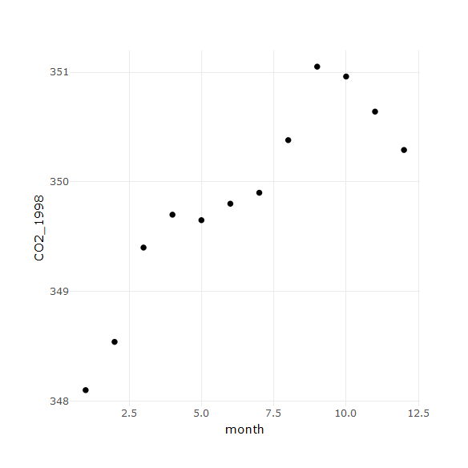
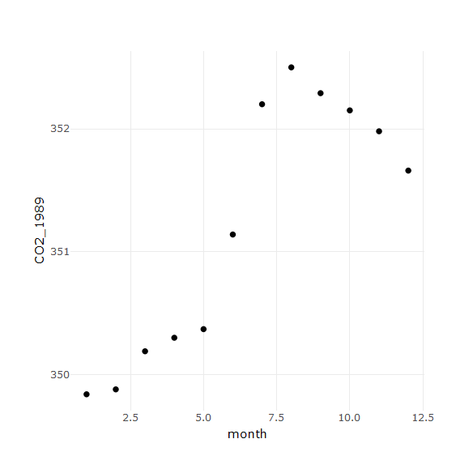

<style>
body {
    overflow: scroll;
}
</style>

<style>
  .chart .jreveal .state-background {
  background: black;
} 
</style>


Presentation - Stat2Data
========================================================
author: Guillermo Hernandez
date: 24-02-2021
autosize: true
font-family: Helvetica
css: style.css
transition: fade

<div align="bottom">

</div>

Stat2Data
========================================================
navigation: section
incremental: true

Stat2Data is a package containing a huge amount of datasets extracted from the textbook Stat2: Modeling with Regression and ANOVA.

More information can be found in [CRAN website](https://cran.r-project.org/web/packages/Stat2Data/index.html8) and in the [reference PDF](https://cran.r-project.org/web/packages/Stat2Data/Stat2Data.pdf).

Some of these datasets include:

1. ~~CO2SouthPole~~ (the one we are going to use)
<li class='fragment fade-out'>Airlines</li>
<li class='fragment fade-out'>AppleStock</li>

The Dataset
========================================================

`CO2SouthPole` contains CO2 concentration measurements (in ppm) in a scientific settlement in Antarctica. 


```r
library(Stat2Data)

data(CO2SouthPole)
head(CO2SouthPole)
```

```
  Year Month    CO2 t
1 1988     1 348.10 1
2 1988     2 348.54 2
3 1988     3 349.40 3
4 1988     4 349.70 4
5 1988     5 349.65 5
6 1988     6 349.80 6
```

For the sake of the example, let's take the monthly data of 1988 and 1989 (only the month and the CO2 value). 

Data from 1988/1989
========================================================

## 1988

```
   Month    CO2
1      1 348.10
2      2 348.54
3      3 349.40
4      4 349.70
5      5 349.65
6      6 349.80
7      7 349.90
8      8 350.38
9      9 351.05
10    10 350.96
11    11 350.64
12    12 350.29
```
***
## 1989

```
   Month    CO2
13     1 349.84
14     2 349.88
15     3 350.19
16     4 350.30
17     5 350.37
18     6 351.14
19     7 352.20
20     8 352.50
21     9 352.29
22    10 352.15
23    11 351.98
24    12 351.66
```


Charts
========================================================
navigation: section
class: chart



***


Dual Chart for Comparison
========================================================
class: chart

The previous charts are almost wrong: x axis is numerical and cannot be interpreted easily, axis labels are too simple...
Here we design a good barplot for the two years simultaneously. 




